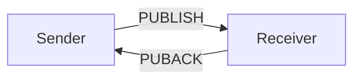
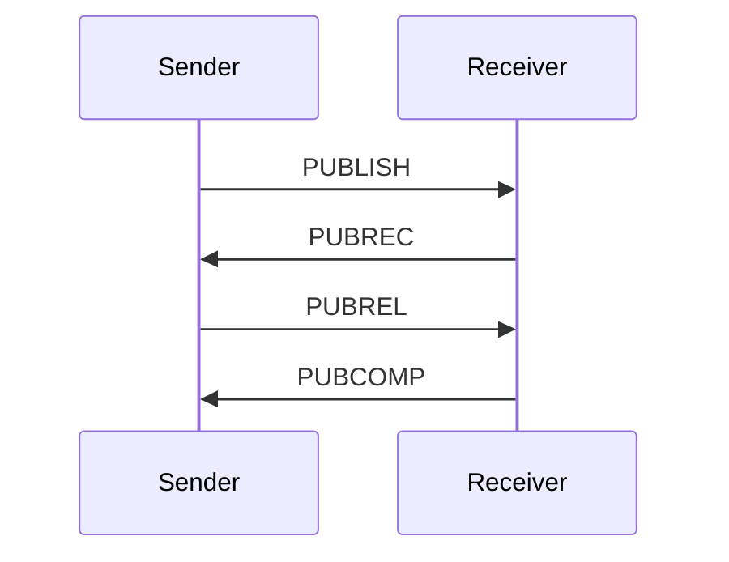

# MQTT协议(二)MQTTQos与Retained
来源《MQTT协议快速入门》
- MQTT十分适合在网络带宽窄、信号不稳定的环境下传输数据的协议，这个MQTT设计了一套保证消息稳定传输的机制，包括消息应答、存储和重传。
- MQTT中的Qos和Retained机制为传输协议的稳定提供了保障
## Qos(发布等级)
MQTT提供了三种不同层次的Qos
- QoS0 At most once ，至多一次
- Qos1 At least once，至少一次
- Qos2 At Exactly once,确保只有一次
  
QoS 是消息的发送方（Sender）和接受方（Receiver）(cilent，servicer)之间达成的一个协议：
- QoS0 代表，Sender 发送的一条消息，Receiver 最多能收到一次，也就是说 Sender 尽力向 Receiver 发送消息，如果发送失败，也就算了；
- QoS1 代表，Sender 发送的一条消息，Receiver 至少能收到一次，也就是说 Sender 向 Receiver 发送消息，如果发送失败，会继续重试，直到 Receiver 收到消息为止，但是因为重传的原因，Receiver 有可能会收到重复的消息；
- QoS2 代表，Sender 发送的一条消息，Receiver 确保能收到而且只收到一次，也就是说 Sender 尽力向 Receiver 发送消息，如果发送失败，会继续重试，直到 Receiver 收到消息为止，同时保证 Receiver 不会因为消息重传而收到重复的消息。

<b>[注意]</b>Qos是Sender 和 Receiver 之间达成的协议(cilent，servicer)，不是 Publisher 和 Subscriber 之间达成的协议。也就是说 Publisher 发布一条 QoS1 的消息，只能保证 Broker (servicer)能至少收到一次这个消息；至于对应的 Subscriber 能否至少收到一次这个消息，还要取决于 Subscriber 和 Broker(servicer) 协商的 QoS 等级。

### Qos0

QoS0 是最简单的一个 QoS 等级了，在这个 QoS 等级下，Sender 和 Receiver 之间一次消息的传递流程如下：

- Sender 向 Receiver 发送一个包含消息数据的 PUBLISH 包，然后不管结果如何，丢弃掉已发送的 PUBLISH 包，一条消息的发送完成。

### Qos1

QoS 要保证消息至少到达 Sender 一次，所以有一个应答的机制，在 Qos1 等级下的 Sender 和 Receiver 的一次消息的传递流程如下:

- 1.	Sender 向 Receiver 发送一个带有消息数据的 PUBLISH 包， 并在本地保存这个 PUBLISH 包。
- 2.    Receiver 收到 PUBLISH 包以后，向 Sender 发送一个 PUBACK 数据包，PUBACK 数据包没有消息体（Payload），在可变头中（Variable header）中有一个包标识（Packet Identifier），和它收到的 PUBLISH 包中的 Packet Identifier 一致。
- 3.	Sender 收到 PUBACK 之后，根据 PUBACK 包中的 Packet Identifier 找到本地保存的 PUBLISH 包，然后丢弃掉，一次消息的发送完成。
- 4.	如果 Sender 在一段时间内没有收到 PUBLISH 包对应的 PUBACK，它将该 PUBLISH 包的 DUP 标识设为 1（代表是重新发送的 PUBLISH 包），然后重新发送该 PUBLISH 包。重复这个流程，直到收到 PUBACK，然后执行第 3 步。

### Qos2
在 QoS2 下，一条消息的传递流程如下：

QoS 使用 2 套请求/应答流程（一个 4 段的握手）来确保 Receiver 收到来自 Sender 的消息，且不重复：
- 1.	Sender 发送 QoS 为 2 的 PUBLISH 数据包，数据包 Packet Identifier 为 P，并在本地保存该 PUBLISH 包；
- 2.	Receiver 收到 PUBLISH 数据包以后，在本地保存 PUBLISH 包的 Packet Identifier P，并回复 Sender 一个 PUBREC 数据包，PUBREC 数据包可变头中的 Packet Identifier 为 P，没有消息体（Payload）；
- 3.	当 Sender 收到 PUBREC，它就可以安全地丢弃掉初始的 Packet Identifier 为 P 的 PUBLISH 数据包，同时保存该 PUBREC 数据包，同时回复 Receiver 一个 PUBREL 数据包，PUBREL 数据包可变头中的 Packet Identifier 为 P，没有消息体；如果 Sender 在一定时间内没有收到 PUBREC，它会把 PUBLISH 包的 DUP 标识设为 1，重新发送该 PUBLISH 数据包（Payload）；
- 4.	当 Receiver 收到 PUBREL 数据包，它可以丢弃掉保存的 PUBLISH 包的 Packet Identifier P，并回复 Sender 一个 PUBCOMP 数据包，PUBCOMP 数据包可变头中的 Packet Identifier 为 P，没有消息体（Payload）；

### Qos2与会话（Session）

- 如果 Client 想接收离线消息，必须使用持久化的会话（Clean Session = 0）连接到 Broker，这样 Broker 才会存储 Client 在离线期间没有确认接收的 QoS 大于 1 的消息。

## 如何选择Qos
### 在以下情况可以选择Qos0
- Client 和 Broker (Servicer)之间的网络连接非常稳定，例如一个通过有线网络 连接到 Broker 的测试用 Client；
- 可以接受丢失部分消息，比如你有一个传感器以非常短的间隔发布状态数据 ，所以丢一些也可以接受；
- 你不需要离线消息。
  
### 在以下情况可以选择Qos1
- 你需要接收所有的消息，而且你的应用可以接受并处理重复的消息；
- 你无法接受 QoS2 带来的额外开销，QoS1 发送消息的速度比 QoS2 快很多。

### 在以下情况可以选择Qos2
- 你的应用必须接收到所有的消息，而且你的应用在重复的消息下无法正常工作，同时你也能接受 QoS2 带来的额外开销。

### 总结
实际上，QoS1 是应用最广泛的 QoS 等级，QoS1 发送消息的速度很快，而且能够保证消息的可靠性。虽然使用 QoS1 可能会收到重复的消息，但是在应用程序里面处理重复消息，通常并不是件难事。

## Retained与LWT(遗嘱)

### Retained
让我们来看一下这个场景：
你有一个温度传感器，它每三个小时向一个 Topic 发布当前的温度。那么问题来了，有一个新的订阅者在它刚刚发布了当前温度之后订阅了这个主题，那么这个订阅端什么时候能才能收到温度消息？
是的，它必须等到三个小时以后，温度传感器再次发布消息的时候才能收到。在这之前，这个新的订阅者对传感器的温度数据一无所知。
怎么来解决这个问题呢？
这个时候就轮到 Retained 消息出场解决这个问题了。Retained 消息是指在 PUBLISH 数据包中 Retain 标识设为 1 的消息，Broker 收到这样的 PUBLISH 包以后，将保存这个消息，当有一个新的订阅者订阅相应主题的时候，Broker 会马上将这个消息发送给订阅者。
Retain 消息有以下一些特点：
- 一个 Topic 只能有 1 条 Retained 消息，发布新的 Retained 消息将覆盖老的 Retained 消息；
- 如果订阅者使用通配符订阅主题，它会收到所有匹配的主题上的 Retained 消息；
- 只有新的订阅者才会收到 Retained 消息，如果订阅者重复订阅一个主题，也会被当做新的订阅者，然后收到 Retained 消息；
- Retained 消息发送到订阅者时，消息的 Retain 标识仍然是 1，订阅者可以判断这个消息是否是 Retained 消息，以做相应的处理。

<b>[注意]</b>：
- Retained 消息和持久性会话(Session)没有任何关系，Retained 消息是 - Broker 为每一个 Topic 单独存储的，而持久性会话是 Broker 为每一个 Client 单独存储的。
- 如果你想删除一个 Retained 消息也很简单，只要向这个主题发布一个 Payload 长度为 0 的 Retained 消息就可以了(覆盖为0的消息)
- 那么开头我们提到的那个场景的解决方案就很简单了，温度传感器每 3 个小时-发布当前的温度的 Retained 消息，那么无论新的订阅者什么时候进行订阅，它都能收到温度传感器上一次发布的数据。

### Retained的其他主要应用
- 如果订阅者无法和Broker连接，可以通过retain消息让订阅者在下次成功连接时一次性接收所有的内容 
- 发布者定时发布retain消息，订阅者获取该信息后能推测发布者的状态（last good value） 

### 最后遗嘱LWT(Last Will & Testament)
MQTT本身就是为信号不稳定的网络设计的，所以难免一些客户端会无故的和Broker断开连接。 

- 当客户端连接到Broker时，可以指定LWT（CONNECT报文），Broker会定期检测客户端是否有异常。 
- 当客户端异常掉线时，Broker就往连接时指定的topic里推送当时指定的LWT消息。 
- LWT相关设置在CONNECT报文中配设完成
- LWT经常和保留消息一起使用，把每个客户端的状态保存到一个Topic下。 如：在客户端 A 进行连接时候，遗嘱消息设定为”offline“，客户端 B 订阅这个遗嘱主题。 当 A 异常断开时，客户端 B 会收到这个”offline“的遗嘱消息，从而知道客户端 A 离线了。
- LWT在客户端正常调用 disconnect 报文之后并不会被发送。