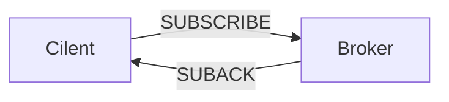

# MQTT协议(五)SUBSCRIBE与UNSUBSCRIBE报文
来源：https://www.cnblogs.com/hayasi/p/7792191.html
https://blog.csdn.net/YuYunTan/article/details/102514194
MQTT协议特点为通过订阅发布式接收/发布信息，想要理解订阅报文SUBSCRIBE就需要理解什么是主题。

## Topic(主题)
- 客户端知道服务器上有很多个主题。就好比如说有很多消息的分类一样子。有社会新闻、体育讲坛等。那么客户端只要找到自己感兴趣的进行订阅就可以了。一个客户端可以向服务器订阅多个主题。
- 一个客户端可以向服务器订阅(SUBSCRIBE)多个主题。而所谓的发布（PUBLISH）就是客户端对不同的主题进行发布信息。即好比如新闻的发布者一样子。这个时候只要订阅这个主题的客户端就可以接收到来自服务端的新闻。
- 如果主题只是一个字符串值的话，那么显然会比较单调。这样子功能也显得比较无力。可以使用分隔让主题可以分层次。就好如说主题“体育讲坛/篮球/NBA”。
### Topic(主题)通配符
- 此时还会产生一个问题，如果我们订阅了主题“体育讲坛/篮球/NBA”，并向主题“体育讲坛/篮球”发布一个信息。那么已经订阅主题“体育讲坛/篮球/NBA”的客户端们是不是可以接受到信息呢？
那么通配符的功能就出来了。通配符有俩种——"+"和“#”。
- <b>+为单层的通配符</b>。表示当前这一层的全都合法。我们订阅一个主题为“体育讲坛/篮球/+”。按照理解的意思就是只要是在“体育讲坛/篮球”的信息都是我们想要的。如：“体育讲坛/篮球/NBA”和“体育讲坛/篮球/CBA”中的消息都会被推送至订阅者
- 那么如果我们对主题“体育讲坛/篮球”或是主题“体育讲坛/篮球/NBA/福州专场”发布信息呢？很可惜，这样不会收到上述两种主题的消息。“+”通配符只是表示当前一层的。从当前的第二层就不行了。而本身的层也不算。就像上面的。只有篮球下的子一层才是合法的。
- <b> “#“通配符就是表示当前本身和下面子层所有</b>。如订阅主题“体育讲坛/篮球/#”，那么"体育讲坛/篮球/NBA/福州专场","体育讲坛/篮球/NBA"，“体育讲坛/篮球”上的主题中的消息都会被推送至订阅者
- <b> "$"通配符表示匹配一个字符，只要不是放在主题的最开头开头。而放在开头时一般用于系统内部的一些主题</b>，一些第三方的MQTT服务器，都会有很多以"\$"开头的主题。
- 对于主题，在MQTT文档中有一个要求——主题不能以 <b>”#“ "+" "$" 为开头</b>。

## SUBSCRIBE报文
- 客户端向服务端发送SUBSCRIBE报文用于创建一个或多个订阅。每个订阅(Subscription)注册客户端所感兴趣的一个或多个主题。服务器将PUBLISH数据报文发送到客户端，以转发那些被发布到与这些订阅匹配的主题的应用程序消息。SUBSCRIBE报文同样(为每个订阅)指定了服务端可以向其发送的应用消息最大QoS等级。
SUBSCRIBE具体流程如下：

- SUBSCRIBE报文有<b>固定报头</b>,<b>可变报头</b>,以及<b>有效载荷</b>部分：

### 固定报头
<table border="0" align="center">
 <tr>
  <td width="27" align="center">Bit</td>
  <td width="27" align="center">7</td>
  <td width="27" align="center">6</td>
  <td width="27" align="center">5</td>
  <td width="27" align="center">4</td>
  <td width="27" align="center">3</td>
  <td width="27" align="center">2</td>
  <td width="27" align="center">1</td>
  <td width="27" align="center">0</td>
 </tr>
 <tr>
  <td>byte1</td>
  <td colspan="4" align="center">MQTT控制报文类型</td>
  <td colspan="4" align="center">指定控制报文标志位</td>
 </tr>
 <tr>
  <td></td>
  <td align="center">1</td>
  <td  align="center">0</td>
  <td  align="center">0</td>
  <td  align="center">0</td>
  <td  align="center">0</td>
  <td  align="center">0</td>
  <td  align="center">1</td>
  <td  align="center">0</td>
 </tr>
 <tr>
  <td  align="center">byte2</td>
  <td colspan="8"  align="center">剩余长度</td>
 </tr>
</table>

- SUBSCRIBE报文固定报头第一个字节的第3，2，1，0bit是保留位，必须被设置为0，0，1，0。服务端必须将其他的任何值都当做是不合法的并关闭网络连接。
- 剩余长度字段
表示可变报头的长度加上有效载荷的长度，被编码为变长字节整数。(一个字节)

### 可变报头
SUBSCRIBE报文可变报头需要包含以下报文标识符(Packet Identifier)字段,下图展示一个包含报文标识符为10的可变报头:
<table border="0" align="center">
 <tr>
  <td align="center"></td>
  <td align="center">描述</td>
  <td align="center">7</td>
  <td align="center">6</td>
  <td align="center">5</td>
  <td align="center">4</td>
  <td align="center">3</td>
  <td align="center">2</td>
  <td align="center">1</td>
  <td align="center">0</td>
 </tr>
 <tr>
  <td colspan="10" align="center">报文标识符</td>
 </tr>
 <tr>
  <td align="center">byte1</td>
  <td align="center">报文标识符MSB</td>
  <td align="center">0</td>
  <td align="center">0</td>
  <td align="center">0</td>
  <td align="center">0</td>
  <td align="center">0</td>
  <td align="center">0</td>
  <td align="center">0</td>
  <td align="center">0</td>
 </tr>
 <tr>
  <td align="center">byte2</td>
  <td align="center">报文标识符LSB</td>
  <td align="center">0</td>
  <td align="center">0</td>
  <td align="center">0</td>
  <td align="center">0</td>
  <td align="center">1</td>
  <td align="center">0</td>
  <td align="center">1</td>
  <td align="center">0</td>
 </tr>
</table>

### 有效载荷
SUBSCRIBE的有效载荷包含<b>主题过滤器列表</b>以及<b>服务质量要求((Requested QoS)</b>
- SUBSCRIBE报文的有效载荷包含一个主题过滤器列表，表示客户端想要订阅的主题。SUBSCRIBE报文有效载荷中的主题过滤器列表必须是UTF-8字符串。
- 服务端应该支持包含通配符的主题过滤器。如果服务端选择不支持包含通配符的主题过滤器，必须拒绝任何包含通配符过滤器的订阅请求。每一个过滤器后面跟着一个字节，这个字节被叫做服务质量要求(Requested QoS)。它给出了服务端向客户端发送应用消息所允许的最大QoS等级。
- 一个SUBSCRIBE报文可以使用多个主题过滤器，但必须和Qos成对出现
- SUBSCRIBE报文的有效载荷必须包含至少一对主题过滤器/QoS字段组合。没有有效载荷的SUBSCRIBE报文是违反协议的。
- 请求的最大服务质量等级字段编码为一个字节，它后面跟着UTF-8编码的主题名，那些主题过滤器/QoS 组合是连续地打包。

<table border="0" align="center">
 <tr>
  <td align="center"></td>
  <td align="center">描述</td>
  <td align="center">7</td>
  <td align="center">6</td>
  <td align="center">5</td>
  <td align="center">4</td>
  <td align="center">3</td>
  <td align="center">2</td>
  <td align="center">1</td>
  <td align="center">0</td>
 </tr>
 <tr>
  <td colspan="10" align="center">主题过滤器</td>
 </tr>
 <tr>
  <td align="center">byte1</td>
  <td colspan="9" align="center">主题过滤器MSB</td>
 </tr>
 <tr>
  <td align="center">byte2</td>
  <td colspan="9" align="center">主题过滤器LSB</td>
 </tr>
  <tr>
  <td align="center">byte3...N</td>
  <td colspan="9" align="center">主题过滤器</td>
 </tr>
  <tr>
  <td colspan="10" align="center">服务质量要求((Requested QoS)</td>
 </tr>
  <tr>
  <td align="center"></td>
  <td colspan="7" colspan="10" align="center">保留位</td>
  <td colspan="2" align="center">Qos等级</td>
 </tr>
<td align="center">byteN+1</td>
  <td align="center">主题过滤器LSB</td>
  <td align="center">0</td>
  <td align="center">0</td>
  <td align="center">0</td>
  <td align="center">0</td>
  <td align="center">0</td>
  <td align="center">0</td>
  <td align="center">x</td>
  <td align="center">x</td>
</table>

## SUBSCRIBE行为
- 服务端收到客户端发送的一个SUBSCRIBE报文时，必须使用SUBACK报文响应。SUBACK报文必须和等待确认的SUBSCRIBE报文有相同的报文标识符
- 允许服务端在发送SUBACK报文之前就开始发送与订阅相匹配的PUBLISH报文。
- 如果服务端收到一个SUBSCRIBE报文，报文的主题过滤器与一个当前会话订阅的主题过滤器相同，那么必须使用新的订阅彻底替换现存的订阅。新订阅的主题过滤器和之前订阅的相同，但是它的最大QoS值可以不同。
- 与这个主题过滤器匹配的任何现存的保留消息必须被重发，但是发布流程不能中断。
如果主题过滤器不同于任何当前会话任何订阅的过滤器，服务端会创建一个新的订阅并发送所有匹配的保留消息。
- 如果服务端收到包含多个主题过滤器的SUBSCRIBE报文，它必须如同收到了一系列的多个SUBSCRIBE报文一样处理那个，除了需要将它们的响应合并到一个单独的SUBACK报文发送。
- 服务端发送给客户端的SUBACK报文对每一对主题过滤器 和QoS等级都必须包含一个返回码。这个返回码必须表示那个订阅被授予的最大QoS等级，或者表示这个订阅失败。服务端可以授予比订阅者要求的低一些的QoS等级。为响应订阅而发出的消息的有效载荷的QoS必须是原始发布消息的QoS和服务端授予的QoS两者中的最小值。如果原始消息的QoS是1而被授予的最大QoS是0，允许服务端重复发送一个消息的副本给订阅者。
- 对某个特定的主题过滤器，如果正在订阅的客户端被授予的最大QoS等级是1，那么匹配这个过滤器的QoS等级0的应用消息会按QoS等级0分发给这个客户端。这意味着客户端最多收到这个消息的一个副本。从另一方面说，发布给同一主题的QoS等级2的消息会被服务端降级到QoS等级1再分发给客户端，因此客户端可能会收到重复的消息副本。
- 如果正在订阅的客户端被授予的最大QoS等级是0，那么原来按QoS等级2发布给客户端的应用消息在繁忙时可能会丢失，但是服务端不应该发送重复的消息副本。发布给同一主题的 QoS等级1的消息在传输给客户端时可能会丢失或重复。
- 使用QoS等级2订阅一个主题过滤器等于是说：我想要按照它们发布时的QoS等级接受匹配这个过滤器的消息 。这意味着，确定消息分发时可能的最大QoS等级是发布者的责任，而订阅者可以要求服务端降低QoS到更适合它的等级。

## SUBACK
- 服务端发送SUBACK报文给客户端，用于确认它已收到并且正在处理SUBSCRIBE报文。
- SUBACK报文包含一个返回码清单，它们指定了SUBSCRIBE请求的每个订阅主题过滤器被授予的最大QoS等级。
- SUBACK报文有<b>固定报头</b>,<b>可变报头</b>,<b>有效载荷</b>：
### 固定报头
<table border="0" align="center">
 <tr>
  <td width="27" align="center">Bit</td>
  <td width="27" align="center">7</td>
  <td width="27" align="center">6</td>
  <td width="27" align="center">5</td>
  <td width="27" align="center">4</td>
  <td width="27" align="center">3</td>
  <td width="27" align="center">2</td>
  <td width="27" align="center">1</td>
  <td width="27" align="center">0</td>
 </tr>
 <tr>
  <td>byte1</td>
  <td colspan="4" align="center">MQTT控制报文类型</td>
  <td colspan="4" align="center">指定控制报文标志位</td>
 </tr>
 <tr>
  <td></td>
  <td align="center">1</td>
  <td  align="center">0</td>
  <td  align="center">0</td>
  <td  align="center">1</td>
  <td  align="center">0</td>
  <td  align="center">0</td>
  <td  align="center">0</td>
  <td  align="center">0</td>
 </tr>
 <tr>
  <td  align="center">byte2</td>
  <td colspan="8"  align="center">剩余长度</td>
 </tr>
</table>
剩余长度字段
等于可变报头的长度加上有效载荷的长度。

### 可变报头
可变报头包含等待确认的SUBSCRIBE报文的报文标识符:
如上文中SUBSCRIBE中报文标识符为10，则SUBACK中报文标识符也为10
<table border="0" align="center">
 <tr>
  <td align="center"></td>
  <td align="center">描述</td>
  <td align="center">7</td>
  <td align="center">6</td>
  <td align="center">5</td>
  <td align="center">4</td>
  <td align="center">3</td>
  <td align="center">2</td>
  <td align="center">1</td>
  <td align="center">0</td>
 </tr>
 <tr>
  <td colspan="10" align="center">报文标识符</td>
 </tr>
 <tr>
  <td align="center">byte1</td>
  <td align="center">报文标识符MSB</td>
  <td align="center">0</td>
  <td align="center">0</td>
  <td align="center">0</td>
  <td align="center">0</td>
  <td align="center">0</td>
  <td align="center">0</td>
  <td align="center">0</td>
  <td align="center">0</td>
 </tr>
 <tr>
  <td align="center">byte2</td>
  <td align="center">报文标识符LSB</td>
  <td align="center">0</td>
  <td align="center">0</td>
  <td align="center">0</td>
  <td align="center">0</td>
  <td align="center">1</td>
  <td align="center">0</td>
  <td align="center">1</td>
  <td align="center">0</td>
 </tr>
</table>

### 有效载荷

有效载荷包含一个返回码清单。每个返回码对应等待确认的SUBSCRIBE报文中的一个主题过滤器。返回码的顺序必须和SUBSCRIBE报文中主题过滤器的顺序相同

<table border="0" align="center">
 <tr>
  <td width="27" align="center">Bit</td>
  <td width="27" align="center">7</td>
  <td width="27" align="center">6</td>
  <td width="27" align="center">5</td>
  <td width="27" align="center">4</td>
  <td width="27" align="center">3</td>
  <td width="27" align="center">2</td>
  <td width="27" align="center">1</td>
  <td width="27" align="center">0</td>
 </tr>
 <tr>
 <td colspan="9"  align="center">返回码</td>
 </tr>
 <tr>
  <td>byte1</td>
  <td  align="center">X</td>
  <td  align="center">0</td>
  <td  align="center">0</td>
  <td  align="center">0</td>
  <td  align="center">0</td>
  <td  align="center">0</td>
  <td  align="center">X</td>
  <td  align="center">X</td>
 </tr>
</table>

允许的返回码值：
0x00 – 最大QoS 0
0x01 – 成功 – 最大QoS 1
0x02 – 成功 – 最大 QoS 2
0x80 – Failure 失败

0x00, 0x01, 0x02, 0x80之外的SUBACK返回码是保留的，不能使用

## UNSUBSCRIBE
大致与SUBSCRIBE相同，其中有两点稍微不同:
- 固定报头中的控制报文类型为1010
- 无服务质量要求((Requested QoS)字节，所以其主题过滤器连续打包
### UNSUBSCRIBE的响应
- UNSUBSCRIBE报文提供的主题过滤器（无论是否包含通配符）必须与服务端持有的这个客户端的当前主题过滤器集合逐个字符比较。如果有任何过滤器完全匹配，那么它（服务端）自己的订阅将被删除，否则不会有进一步的处理：
如果服务端删除了一个订阅：
  - 它必须停止分发任何新消息给这个客户端。
  - 它必须完成分发任何已经开始往客户端发送的QoS 1和QoS 2的消息。
  - 它可以继续发送任何现存的准备分发给客户端的缓存消息。
- 服务端必须发送UNSUBACK报文响应客户端的UNSUBSCRIBE请求。UNSUBACK报文必须包含和UNSUBSCRIBE报文相同的报文标识符。
- 即使没有删除任何主题订阅，服务端也必须发送一个UNSUBACK响应。
- 如果服务端收到包含多个主题过滤器的UNSUBSCRIBE报文，它必须如同收到了一系列的多个UNSUBSCRIBE报文一样处理那个报文，除了将它们的响应合并到一个单独的UNSUBACK报文外。<b>也就是说，它会发很多个 UNSUBACK 报文回来.</b>

## UNSUBACK
- 服务端发送UNSUBACK报文给客户端用于确认收到UNSUBSCRIBE报文。UNSUBACK 报文是对UNSUBSCRIBE报文的响应。
UNSUBACK 报文的组成（没有有效载荷）= 一个固定报头(0xb0 0x02) + Packet Identifier （from UNSUBSCRIBE's Packet Identifier）。