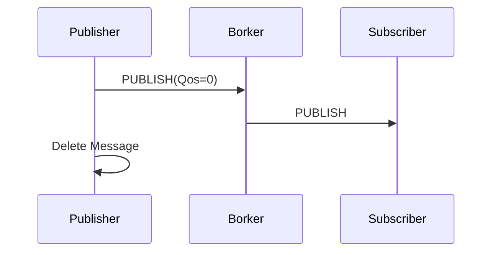
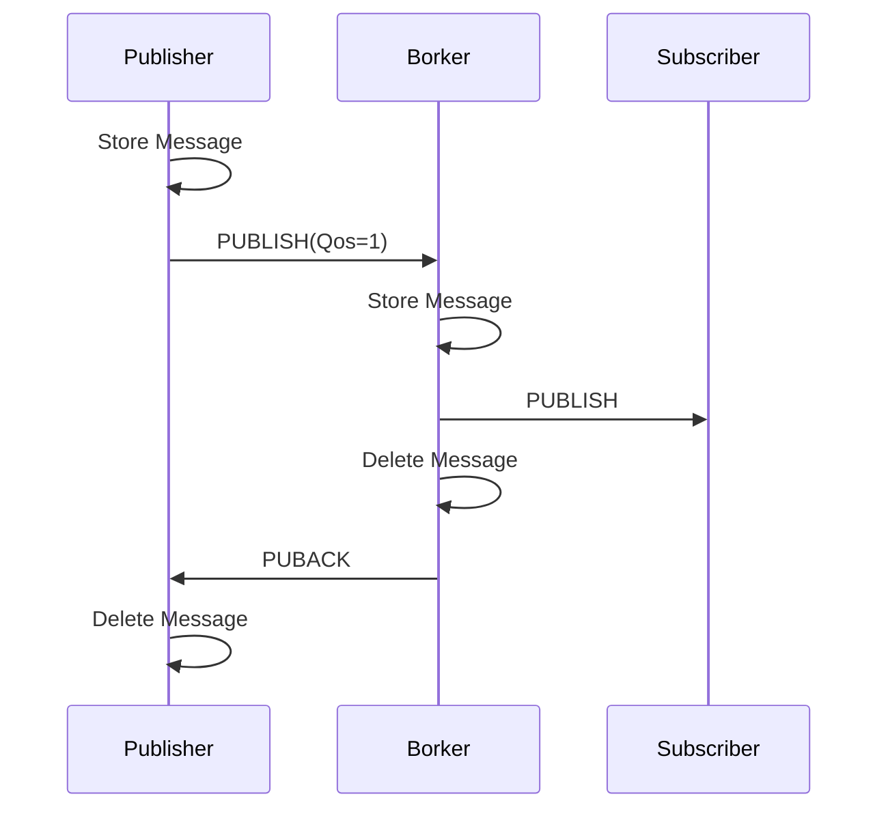
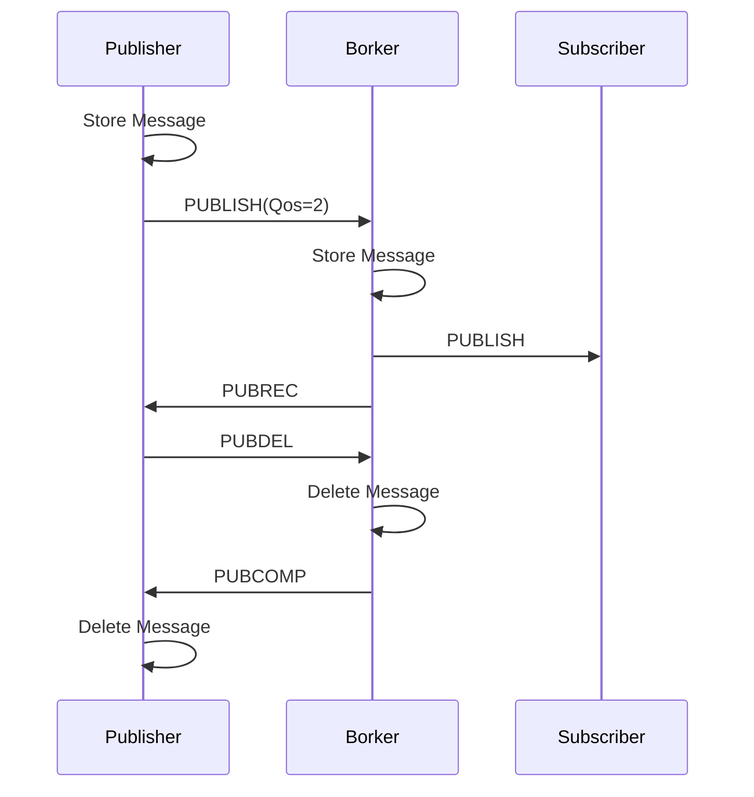

# MQTT协议(六)PUBLISH&PUBACK&PUBREC&PUBREL&PUBCOMP
资料来源：
https://blog.csdn.net/weixin_41572450/article/details/82504086
- 由于PUBLISH报文报文与Qos等级，Retain机制相关，所以需要阅读MQTT2——MQTT特性 Qos&Retain机制
## PUBLISH
- PUBLISH报文方向是客户端到服务端或者服务端到客户端发布消息控制报文，是双向的。
- PUBLISH报文含有<b>固定报头</b>，<b>可变报头</b>，<b>以及有效载荷</b>

### <b>固定报头</b>
- PUBLISH报文控制报文类型为0011 ，指定控制报文标志位 为DUP \qos（2bit）\retain设置位
<table border="0" align="center">
 <tr>
  <td width="27" align="center">Bit</td>
  <td width="27" align="center">7</td>
  <td width="27" align="center">6</td>
  <td width="27" align="center">5</td>
  <td width="27" align="center">4</td>
  <td width="27" align="center">3</td>
  <td width="27" align="center">2</td>
  <td width="27" align="center">1</td>
  <td width="27" align="center">0</td>
 </tr>
 <tr>
  <td>byte1</td>
  <td colspan="4" align="center">MQTT控制报文类型</td>
  <td  align="center">DUP</td>
  <td colspan="2" align="center">QOS</td>
  <td  align="center">RETAIN</td>
 </tr>
 <tr>
  <td></td>
  <td align="center">0</td>
  <td  align="center">0</td>
  <td  align="center">1</td>
  <td  align="center">1</td>
  <td  align="center">x</td>
  <td  align="center">x</td>
  <td  align="center">x</td>
  <td  align="center">x</td>
 </tr>
 <tr>
  <td  align="center">byte2</td>
  <td colspan="8"  align="center">剩余长度</td>
 </tr>
 <tr>
  <td></td>
  <td align="center">x</td>
  <td align="center">x</td>
  <td align="center">x</td>
  <td align="center">x</td>
  <td align="center">x</td>
  <td align="center">x</td>
  <td align="center">x</td>
  <td align="center">x</td>
 </tr>
</table>
以下介绍publish中控制报文标志具体含义（可查看MQTT（二）特性Qos&Retain）：

#### ①<b>DUP重发标志</b>
   - 当DUP被设置为0，表示客户端或者服务器是第一次发送这个PUBLISH报文
   - 当DUP被设置为1，表示这可能是一个早期报文的重发
   - 当Qos=0时，DUP 必须为0 
#### ②<b>QoS服务质量等级</b>
<table  border="0" align="center">
<tr>
<td align="center">QoS值</td>
<td align="center">Bit2</td>
<td align="center">Bit1</td>
<td align="center">描述</td>
</tr>
<tr>
<td align="center">0</td>
<td align="center">0</td>
<td align="center">0</td>
<td align="center">最多分发一次</td>
<tr>
<td align="center">1</td>
<td align="center">0</td>
<td align="center">1</td>
<td align="center">至少分发一次</td>
</tr>
<tr>
<td align="center">2</td>
<td align="center">1</td>
<td align="center">0</td>
<td align="center">只分发一次</td>
</tr>
<tr>
<td align="center">-</td>
<td align="center">1</td>
<td align="center">1</td>
<td align="center">保留位</td>
</tr>
</table>

- QoS 0(At most once)“至多一次”
    消息发布完全依赖底层 TCP/IP 网络。会发生消息丢失或重复。这一级别可用于如下情况，环境传感器数据，丢失一次读记录无所谓，因为不久后还会有第二次发送。

- QoS 1(At least once)“至少一次”
    确保消息到达，但消息重复可能会发生。

- QoS 2(Exactly once)“只有一次”

- [注]：发布者或者订阅者设置的QoS分别是和服务器端异步执行的，即使发布者设置发布消息为QoS2，订阅者也可以通过QoS0或QoS1来订阅该消息（这样就是QoS的降级downgrade）。
#### ③<b>RETAIN保留标志</b>
- 如果被置为1，服务端必须存储这个topic和它的QoS ，以便它可以被Broker分发给未来的和主题名匹配的订阅者，但是RETAIN=1的Qos=0的PUBLISH的报文发送服务器后，保留消息可能会被服务器选择丢弃保留消息。
- 保留消息能使新订阅的客户端立即收到最新的状态消息，而不用等待发布者发送下一个更新，也就是topic的保留标志是最后已知的良好值。
- 如果要删除保留消息，只需向该topic重新publish数据，RETAIN=TRUE，Payload为空，新订阅者就不会收到保留消息。
- 如果客户端发给服务端的 PUBLISH 报文的保留标志位为0， 服务端不能存储这个消息也不能移除或替换任何现存的保留消息。

### <b>可变报头</b>
- PUBLISH报文的可变报头部分有 :<b>主题名</b>,以及<b>报文标识符(Message Identifier)</b>
- 其中报文标识符 只在QOS>0时使用
<table border="0" align="center">
 <tr>
  <td align="center"></td>
  <td align="center">描述</td>
  <td align="center">7</td>
  <td align="center">6</td>
  <td align="center">5</td>
  <td align="center">4</td>
  <td align="center">3</td>
  <td align="center">2</td>
  <td align="center">1</td>
  <td align="center">0</td>
 </tr>
 <tr>
  <td colspan="10" align="center">主题名</td>
 </tr>
 <tr>
  <td align="center">byte1</td>
  <td colspan="9" align="center">主题名MSB</td>
 </tr>
 <tr>
  <td align="center">byte2</td>
  <td colspan="9" align="center">主题名LSB</td>
 </tr>
  <tr>
  <td align="center">byte3...N</td>
  <td colspan="9" align="center">主题名</td>
 </tr>
  <tr>
  <td colspan="10" align="center">报文标识符(Message Identifier)</td>
 </tr>
  <tr>
  <td align="center">byteN+1</td>
    <td colspan="9" align="center">报文标识符MSB</td>
 </tr>
<td align="center">byteN+2</td>
   <td colspan="9" align="center">报文标识符LSB</td>
</table>

### <b>有效载荷</b>
- 一般作为UTF-8编码写入接口，但不排除自定义的消息格式。
- 空的有效载荷（zero-length）的PUBLISH消息也可以是合法的。
- 当服务器接收到空有效载荷(zero-length payload)、retain = 1、具有topic name的一个PUBLISH，表示同时满足retain = 1、相同topic name的这两个特征的被持久化PUBLISH消息，可被删除。
- 有效载荷一般采用jason格式封包。

## PUBACK(仅一次回应)
- 用来作为订阅者/服务器接收（QoS level = 1）PUBLISH消息之后对发送者的响应，整个消息不复杂。
- 其没有有效载荷，只有固定报头以及可变报头
- 变头部附加一个16位的无符号short类型，表明一个被确认的PUBLISH消息的消息标识符（Message ID） 。
<table border="0" align="center">
 <tr>
  <td align="center"></td>
  <td align="center">描述</td>
  <td align="center">7</td>
  <td align="center">6</td>
  <td align="center">5</td>
  <td align="center">4</td>
  <td  align="center">3</td>
  <td align="center">2</td>
  <td align="center">1</td>
  <td align="center">0</td>
 </tr>
 <tr>
  <td colspan="10" align="center">固定报头</td>
 </tr>
 <tr>
  <td align="center"></td>
<td align="center"></td>
  <td colspan="4" align="center">控制报文类型</td>
  <td align="center">DUP</td>
  <td colspan="2" align="center">QoS</td>
  <td  colspan="4" align="center">RETAIN</td>
 </tr>
 <tr>
  <td align="center">byte1</td>
  <td align="center"></td>
  <td align="center">0</td>
  <td align="center">1</td>
  <td align="center">0</td>
  <td align="center">0</td>
  <td align="center">x</td>
  <td align="center">x</td>
  <td align="center">x</td>
  <td align="center">x</td>
 </tr>
  <tr>
  <td align="center"></td>
  <td align="center"></td>
  <td colspan="9" align="center">剩余长度(2)</td>
 </tr>
  <tr>
  <td align="center">byte2</td>
  <td align="center"></td>
  <td align="center">0</td>
  <td align="center">0</td>
  <td align="center">0</td>
  <td align="center">0</td>
  <td align="center">0</td>
  <td align="center">0</td>
  <td align="center">1</td>
  <td align="center">0</td>
 </tr>
 <tr>
  <td colspan="10" align="center">报文标识符(Message Identifier)</td>
 </tr>
 <tr>
  <td align="center">byte3</td>
  <td align="center">报文标识符MSB</td>
  <td align="center">X</td>
  <td align="center">X</td>
  <td align="center">X</td>
  <td align="center">X</td>
  <td align="center">X</td>
  <td align="center">X</td>
  <td align="center">X</td>
  <td align="center">X</td>
 </tr>
  <tr>
  <td align="center">byte4</td>
  <td align="center">报文标识符LSB</td>
  <td align="center">X</td>
  <td align="center">X</td>
  <td align="center">X</td>
  <td align="center">X</td>
  <td align="center">X</td>
  <td align="center">X</td>
  <td align="center">X</td>
  <td align="center">X</td>
 </tr>
</table>

## PUBREC(第一次回应)
-  作为订阅者/服务器对（QoS level = 2）的发布PUBLISH消息的发送方的响应，确认已经收到，为QoS level = 2消息流的第二个消息。 和PUBACK相比，除了消息类型不同外，其它都是一样。
-  无论是订阅者还是服务器，在消费PUBREC消息之后需要发送一个PUBREL消息给发送者（和PUBREC具有同样的消息ID），确认已收到。
<table border="0" align="center">
 <tr>
  <td align="center"></td>
  <td align="center">描述</td>
  <td align="center">7</td>
  <td align="center">6</td>
  <td align="center">5</td>
  <td align="center">4</td>
  <td align="center">3</td>
  <td align="center">2</td>
  <td align="center">1</td>
  <td align="center">0</td>
 </tr>
 <tr>
  <td colspan="10" align="center">固定报头</td>
 </tr>
 <tr>
  <td align="center"></td>
<td align="center"></td>
  <td colspan="4" align="center">控制报文类型</td>
  <td align="center">DUP</td>
  <td colspan="2" align="center">QoS</td>
  <td  colspan="4" align="center">RETAIN</td>
 </tr>
 <tr>
  <td align="center">byte1</td>
  <td align="center"></td>
  <td align="center">0</td>
  <td align="center">1</td>
  <td align="center">0</td>
  <td align="center">1</td>
  <td align="center">0</td>
  <td align="center">0</td>
  <td align="center">1</td>
  <td align="center">x</td>
 </tr>
  <tr>
  <td align="center"></td>
  <td align="center"></td>
  <td colspan="9" align="center">剩余长度(2)</td>
 </tr>
  <tr>
  <td align="center">byte2</td>
  <td align="center"></td>
  <td align="center">0</td>
  <td align="center">0</td>
  <td align="center">0</td>
  <td align="center">0</td>
  <td align="center">0</td>
  <td align="center">0</td>
  <td align="center">1</td>
  <td align="center">0</td>
 </tr>
 <tr>
  <td colspan="10" align="center">报文标识符(Message Identifier)</td>
 </tr>
 <tr>
  <td align="center">byte3</td>
  <td align="center">报文标识符MSB</td>
  <td align="center">X</td>
  <td align="center">X</td>
  <td align="center">X</td>
  <td align="center">X</td>
  <td align="center">X</td>
  <td align="center">X</td>
  <td align="center">X</td>
  <td align="center">X</td>
 </tr>
  <tr>
  <td align="center">byte4</td>
  <td align="center">报文标识符LSB</td>
  <td align="center">X</td>
  <td align="center">X</td>
  <td align="center">X</td>
  <td align="center">X</td>
  <td align="center">X</td>
  <td align="center">X</td>
  <td align="center">X</td>
  <td align="center">X</td>
 </tr>
</table>

注意：
- PUBREL消息要求: 
  -  qos等级为1
  -  DUP flag 为0，表示消息第一次被发送。
- 可变头部中，报文标识符和发布者接收到的PUBREC所包含的报文标识符是一致的（message id）。

## PUBCOMP(第三次回应)
- 作为QoS level = 2消息流第四个（第三个回应），也是最后一个消息，由收到PUBREL的一方向另一方做出的响应消息。完整的消息一览，和PUBREL一致，除了消息类型。
<table border="0" align="center">
 <tr>
  <td align="center"></td>
  <td align="center">描述</td>
  <td align="center">7</td>
  <td align="center">6</td>
  <td align="center">5</td>
  <td align="center">4</td>
  <td align="center">3</td>
  <td align="center">2</td>
  <td align="center">1</td>
  <td align="center">0</td>
 </tr>
 <tr>
  <td colspan="10" align="center">固定报头</td>
 </tr>
 <tr>
  <td align="center"></td>
<td align="center"></td>
  <td colspan="4" align="center">控制报文类型</td>
  <td align="center">DUP</td>
  <td colspan="2" align="center">QoS</td>
  <td  colspan="4" align="center">RETAIN</td>
 </tr>
 <tr>
  <td align="center">byte1</td>
  <td align="center"></td>
  <td align="center">0</td>
  <td align="center">1</td>
  <td align="center">1</td>
  <td align="center">0</td>
  <td align="center">x</td>
  <td align="center">x</td>
  <td align="center">x</td>
  <td align="center">x</td>
 </tr>
  <tr>
  <td align="center"></td>
  <td align="center"></td>
  <td colspan="9" align="center">剩余长度(2)</td>
 </tr>
  <tr>
  <td align="center">byte2</td>
  <td align="center"></td>
  <td align="center">0</td>
  <td align="center">0</td>
  <td align="center">0</td>
  <td align="center">0</td>
  <td align="center">0</td>
  <td align="center">0</td>
  <td align="center">1</td>
  <td align="center">0</td>
 </tr>
 <tr>
  <td colspan="10" align="center">报文标识符(Message Identifier)</td>
 </tr>
 <tr>
  <td align="center">byte3</td>
  <td align="center">报文标识符MSB</td>
  <td align="center">X</td>
  <td align="center">X</td>
  <td align="center">X</td>
  <td align="center">X</td>
  <td align="center">X</td>
  <td align="center">X</td>
  <td align="center">X</td>
  <td align="center">X</td>
 </tr>
  <tr>
  <td align="center">byte4</td>
  <td align="center">报文标识符LSB</td>
  <td align="center">X</td>
  <td align="center">X</td>
  <td align="center">X</td>
  <td align="center">X</td>
  <td align="center">X</td>
  <td align="center">X</td>
  <td align="center">X</td>
  <td align="center">X</td>
 </tr>
</table>
